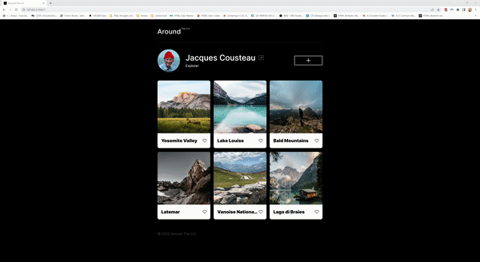

# Project 3: Around The U.S.

This project is the fourth in Practicum's Software Engineering course. It is the second stage of a previous project. This project makes use of JavaScript to show a pop-up window to allow users to edit their profile name and their profile title. Using the `<template>` element and with the help of JavaScript, the page dynamically creates the cards and adds them to the container.

## Project Features

- Semantic HTML
- CSS grid
- CSS media queries
- Responsive web design
- JavaScript

## Future Plans

I hope to add more functionality to the site over the next stages of the course including allowing users to sign up for profiles, interact with other profiles, and add their own cards.

## Preview

## Live Version

<a href="https://skwisgaarr8-9.github.io/se_project_aroundtheus/">Check it out</a>
