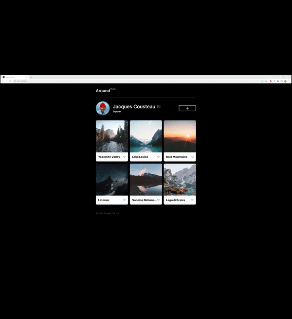

# Project 3: Around The U.S.

This project is the third in Practicum's Software Engineering course. It is the preliminary stage of a project that will come to be an interactable profile where users can post photos in their gallery. Other users will be able to add users to their friends list and like photos. The primary skills focused on are using CSS grid and CSS media queries to make the page responsive to different device screen sizes.

## Project Features

- Semantic HTML
- CSS grid
- CSS media queries
- Responsive web design

## Future Plans

I hope to add more functionality to the site other the next stages of the course including allowing users to sign up for profiles, interacting with other profiles, adding photos, and editing profiles.

## Preview

## Live Version

<a href="https://skwisgaarr8-9.github.io/se_project_aroundtheus/">Check it out</a>
