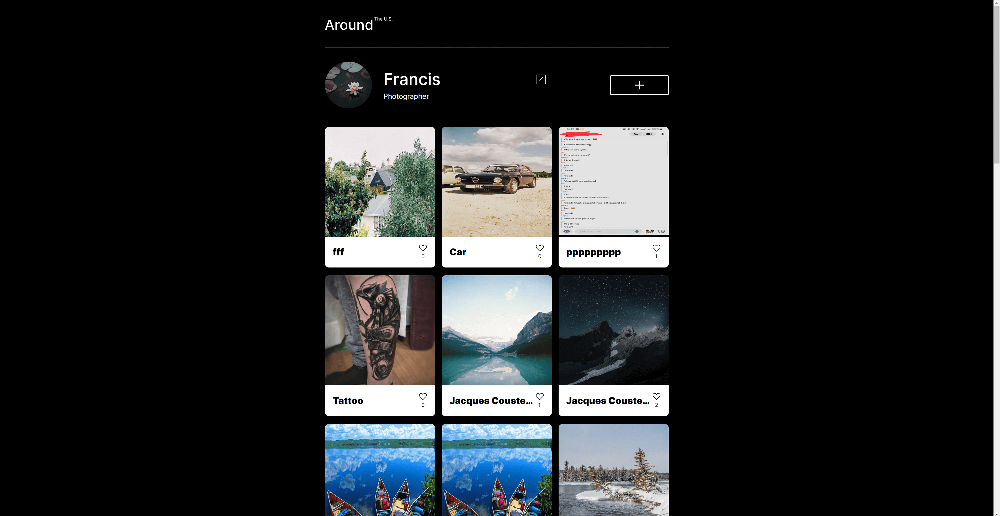

# Project 9: Around The U.S.

This project is the ninth in Practicum's Software Engineering course. It is the seventh stage of a previous project. In this project, I continued to refractor my code, creating a new class named `Api` which I use to make requests to a server to process information. The site now saves profile information when editted, saves new card information, and allows users to change their profile avatars all while making requests to the server to get, send, edit, or delete from the server.

- Semantic HTML
- CSS grid
- CSS media queries
- Responsive web design
- JavaScript
- Form validation
- JavaScript classes
- Webpack
- API requests

## Future Plans

I hope to add more functionality to the site over the next stages of the course including allowing users to sign up for profiles and interact with other profiles.

## Preview

## Live Version

<a href="https://skwisgaarr8-9.github.io/se_project_aroundtheus/">Check it out</a>
