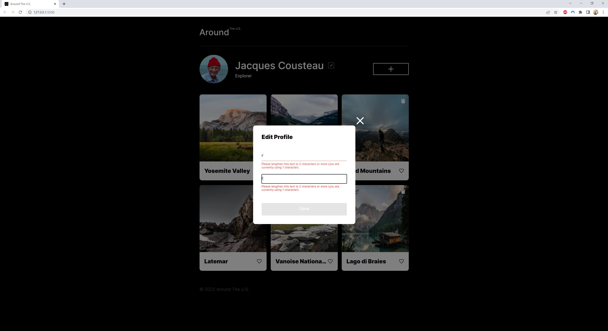
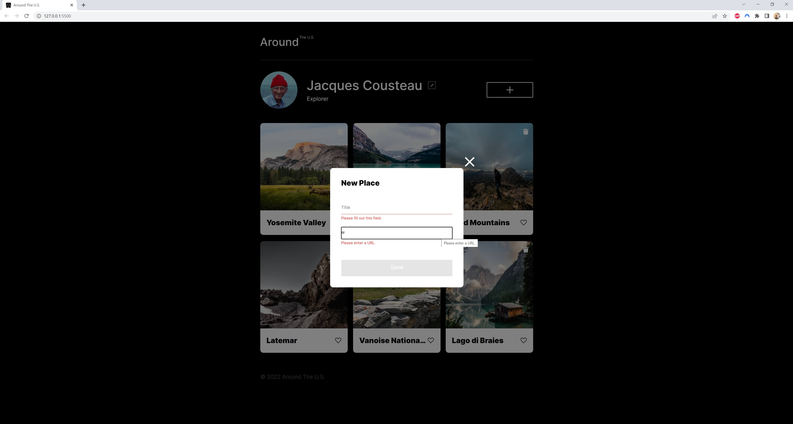

# Project 8: Around The U.S.

This project is the eighth in Practicum's Software Engineering course. It is the sixth stage of a previous project. In this project, I continued to refractor my code, creating new classes `Popup`, `UserInfo`, and subclasses `PopupWithForm` and `PopupWithImage` to handle the modal popups and getting user info from the profile section. I also installed webpack and several other dependencies to help bundle all the files together.

## Project Features

- Semantic HTML
- CSS grid
- CSS media queries
- Responsive web design
- JavaScript
- Form validation
- JavaScript classes
- Webpack

## Future Plans

I hope to add more functionality to the site over the next stages of the course including allowing users to sign up for profiles and interact with other profiles.

## Preview

## Live Version

<a href="https://skwisgaarr8-9.github.io/se_project_aroundtheus/">Check it out</a>
